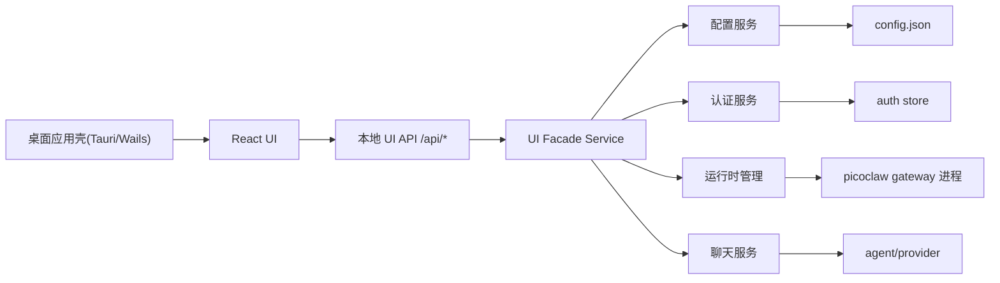

# 游戏助手桌面端架构与接口设计

## 1. 文档目标

本文档用于明确基于 `picoclaw-server` 构建游戏助手桌面端的首期工程方案，覆盖以下内容：

- 桌面端与本地服务的职责边界
- 前端技术栈选择
- 后端最小改动原则
- 前后端 API 设计
- 实时消息机制设计
- 首阶段实施建议

本文档用于项目正式启动阶段，目标是让研发在不大幅重构 `picoclaw-server` 的前提下，快速落地一个可发布、可维护、跨 Windows 和 macOS 的桌面应用。

## 1.1 设计边界

本文档额外遵循以下约束：

- 不做过度设计
- 不为历史接口编写兼容代码
- 不引入版本化 API 路径
- 直接面向当前游戏助手场景开发正式版能力
- 实时通信统一采用 `SSE`

## 2. 项目目标与约束

### 2.1 目标

- 提供一个可下载安装到本地直接运行的桌面应用。
- 用户只配置少量必要项：
  - 模型选择
  - 频道设置
  - Skills 启用
- 其他复杂配置由后端内置默认策略处理，不对用户开放。
- 提供一个简洁的对话页面，支持本地聊天与流式回复。
- 支持后端异步事件推送到前端，例如：
  - 运行状态变化
  - 定时任务执行结果
  - 日志追加
  - 认证状态变化

### 2.2 约束

- 尽量少改动 `picoclaw-server` 核心逻辑。
- 不直接把现有 Web launcher 临时接口作为正式协议使用。
- 第一阶段优先支持 Windows 和 macOS。
- 以本地运行、单机使用为主，不以远程多用户访问为目标。

## 3. 现状分析

当前仓库已存在两套界面入口：

- Web launcher：`cmd/picoclaw-launcher`
- TUI launcher：`cmd/picoclaw-launcher-tui`

其能力如下：

- Web launcher
  - 提供配置编辑、认证、进程控制
  - 前端为单文件嵌入式页面
  - 使用 HTTP `fetch` + 定时轮询
- TUI launcher
  - 直接读写配置
  - 直接控制进程
  - 未复用统一 HTTP 接口层

### 3.1 现有能力可复用项

- 配置读写与默认值：`pkg/config`
- 认证相关能力：`cmd/picoclaw-launcher/internal/server/auth_*`
- 运行控制基础逻辑：`cmd/picoclaw-launcher/internal/server/process.go`
- `gateway` 核心运行流程：`cmd/picoclaw/internal/gateway`

### 3.2 现有能力不适合作为正式协议的原因

- 当前 Web launcher 直接暴露整份 `config.json`
- 当前接口属于临时性质，文档已明确说明后续会重构
- 认证流程直接修改配置文件，缺少稳定的面向 UI 的抽象层
- TUI 与 Web launcher 没有共享统一 API 契约
- 进程控制存在临时实现痕迹，正式产品应补充更稳定的运行管理策略

结论：

- 复用现有实现逻辑
- 不直接复用现有临时接口协议
- 需要新增一层面向正式 UI 的本地接口层

## 4. 核心设计原则

### 4.1 后端最小改动原则

第一阶段不对 `picoclaw-server` 做大规模重构，仅新增面向桌面 UI 的 Facade 接口层。

原则如下：

- 不重写 `gateway` 核心逻辑
- 不改动现有模型、频道、skills 的底层数据结构定义
- 新增一层 DTO 和 Service，将 UI 所需字段从底层配置中映射出来
- 前端不直接读写 `config.json`
- 不为了兼容旧 launcher 协议而保留过渡方案

### 4.2 UI 薄层原则

`picoclaw-ui` 只负责：

- 配置展示和编辑
- 简洁对话体验
- 状态展示
- 异步通知接收

`picoclaw-ui` 不负责：

- 业务规则判断
- 复杂默认值推导
- 运行时配置拼装
- 底层认证逻辑

### 4.3 稳定协议优先

UI 只调用新的正式接口，不直接依赖旧 launcher 的临时 `/api/*` 接口。

这样可以实现：

- 后端内部继续演进
- UI 协议保持稳定
- 避免配置结构变动直接影响前端
- 避免引入版本前缀和兼容包袱

## 5. 技术选型

## 5.1 推荐方案

推荐首期技术栈如下：

- 桌面壳：`Tauri 2`
- 前端框架：`React + Vite`
- 样式系统：`Tailwind CSS + shadcn/ui`

备选方案：

- 桌面壳：`Wails v2`
- 其余技术栈不变

### 5.2 选择理由

#### Tauri 2

优点：

- 更适合“本地前端 + 本地服务”边界模型
- 应用更轻
- 权限模型更清晰
- 适合后续做安装包、更新、平台打包

代价：

- 需要引入 Rust 工具链

#### Wails v2

优点：

- 对 Go 团队更友好
- 学习和接入成本较低

代价：

- 与 Go 绑定更强
- 如果长期坚持“独立本地服务 + 独立前端”的边界，架构表达不如 Tauri 自然

### 5.3 样式方案结论

`Tailwind CSS + shadcn/ui` 适合本项目，原因如下：

- 适合快速搭建设置页、对话页、日志面板、状态卡片
- 组件以源码形式纳入项目，二次定制成本低
- 对桌面应用的品牌化、主题化更友好
- 与 `React + Vite` 组合成熟

结论：

- 前端样式层正式采用 `Tailwind CSS + shadcn/ui`

## 6. 整体架构



### 6.1 模块职责

#### 桌面壳

- 承载 Web UI
- 提供本地应用窗口
- 处理应用打包、安装、更新

#### React UI

- 设置页
- 对话页
- 运行状态面板
- 日志面板
- 异步通知展示

#### UI API 层

- 暴露稳定协议
- 屏蔽底层 `config.Config` 细节
- 统一输入校验和返回格式

#### Facade Service 层

- 组合配置服务、认证服务、运行时服务、聊天服务
- 负责 UI DTO 与底层模型的转换

#### 底层服务层

- 尽量复用现有 `picoclaw-server` 能力

## 7. 前后端通信策略

## 7.1 结论

第一阶段采用：

- `REST`：处理前端主动操作
- `SSE`：处理服务端异步推送

第一阶段不引入 `WebSocket`。

## 7.2 为什么不用纯轮询

纯轮询存在以下问题：

- 实时性依赖轮询间隔
- 会产生大量空请求
- 状态机实现容易混乱
- 不适合聊天流式输出
- 会让当前本地单机场景承担不必要的复杂度

## 7.3 为什么首期不用 WebSocket

本项目第一阶段的核心需求是：

- 前端发起操作
- 服务端异步通知前端
- 聊天流式输出

这类需求不要求前后端通过同一条连接做复杂双向协议协商，因此 `SSE` 更轻、更简单、更容易调试。

只有在未来出现以下需求时再考虑升级到 `WebSocket`：

- 单条连接同时承载大量双向实时命令
- 复杂会话协议
- 更强的连接级路由与多路复用需求

## 7.4 SSE 适用场景

以下事件使用 `SSE` 推送：

- 聊天回复流式输出
- 运行状态变化
- 定时任务执行结果
- 认证状态变化
- 日志追加
- 系统通知

## 8. 页面信息架构

第一阶段建议提供以下页面：

### 8.1 设置页

包含：

- 模型选择
- 频道设置
- Skills 启用
- 认证状态

不包含：

- 原始 JSON 编辑器
- 所有底层高级参数
- 工具层细粒度开关

### 8.2 对话页

包含：

- 会话消息列表
- 输入框
- 流式回复展示
- 系统通知与运行状态提示

### 8.3 状态面板

包含：

- 服务运行状态
- 当前模型
- 已启用频道
- 最近日志

## 9. 数据边界设计

## 9.1 UI 不直接使用底层 Config 结构

不建议前端直接使用 `pkg/config.Config`，原因：

- 字段过多
- 结构复杂且偏底层
- 不符合“只开放少量配置”的产品定位

因此需要定义独立 DTO。

## 9.2 推荐 DTO

### 9.2.1 设置 DTO

```json
{
  "model": {
    "selected": "gpt-5.2"
  },
  "channels": [
    {
      "type": "telegram",
      "enabled": true,
      "fields": {
        "token": "",
        "allow_from": []
      }
    }
  ],
  "skills": {
    "enabled": ["game-helper"]
  }
}
```

### 9.2.2 运行状态 DTO

```json
{
  "status": "running",
  "pid": 12345,
  "health": "ok",
  "uptime_seconds": 120
}
```

### 9.2.3 聊天消息 DTO

```json
{
  "id": "m1",
  "role": "assistant",
  "content": "你好，我在。"
}
```

## 10. API 设计

以下接口均为正式 UI 使用的本地接口。

Base URL：

```text
http://127.0.0.1:18800/api
```

## 10.1 Bootstrap

### `GET /bootstrap`

用途：

- 应用启动时获取基础状态

响应示例：

```json
{
  "app": {
    "name": "PicoClaw UI",
    "version": "0.1.0",
    "platform": "darwin-arm64"
  },
  "server": {
    "version": "0.1.0"
  },
  "runtime": {
    "status": "stopped"
  },
  "settings_summary": {
    "selected_model": "gpt-5.2",
    "enabled_channels": ["telegram"],
    "enabled_skills": ["game-helper"]
  }
}
```

## 10.2 设置接口

### `GET /settings`

用途：

- 获取 UI 受控配置

响应示例：

```json
{
  "model": {
    "selected": "gpt-5.2",
    "options": [
      {
        "id": "gpt-5.2",
        "label": "GPT-5.2",
        "provider": "openai",
        "auth_required": true
      }
    ]
  },
  "channels": [
    {
      "type": "telegram",
      "enabled": true,
      "fields": {
        "token": "",
        "allow_from": []
      }
    }
  ],
  "skills": {
    "enabled": ["game-helper"],
    "installed": [
      {
        "id": "game-helper",
        "name": "Game Helper",
        "source": "local"
      }
    ]
  }
}
```

### `PUT /settings`

用途：

- 保存 UI 配置

请求示例：

```json
{
  "model": {
    "selected": "gpt-5.2"
  },
  "channels": [
    {
      "type": "telegram",
      "enabled": true,
      "fields": {
        "token": "xxx",
        "allow_from": ["123456"]
      }
    }
  ],
  "skills": {
    "enabled": ["game-helper"]
  }
}
```

响应示例：

```json
{
  "status": "ok",
  "message": "settings saved"
}
```

服务端职责：

- 校验 DTO
- 转换为底层配置结构
- 合并默认策略
- 写回 `config.json`

## 10.3 认证接口

### `GET /auth/status`

响应示例：

```json
{
  "providers": [
    {
      "provider": "openai",
      "status": "active",
      "auth_method": "oauth",
      "account_id": "user_xxx"
    }
  ]
}
```

### `POST /auth/login`

请求示例：

```json
{
  "provider": "openai"
}
```

响应示例：

```json
{
  "status": "pending",
  "flow": "device_code",
  "device_url": "https://auth.openai.com/activate",
  "user_code": "ABCD-1234"
}
```

### `POST /auth/logout`

请求示例：

```json
{
  "provider": "openai"
}
```

## 10.4 运行时接口

### `GET /runtime/status`

响应示例：

```json
{
  "status": "running",
  "pid": 12345,
  "uptime_seconds": 320,
  "health": "ok",
  "enabled_channels": ["telegram"]
}
```

### `POST /runtime/start`

响应示例：

```json
{
  "status": "ok"
}
```

### `POST /runtime/stop`

响应示例：

```json
{
  "status": "ok"
}
```

### `GET /runtime/logs?cursor=120`

响应示例：

```json
{
  "items": [
    {
      "id": 121,
      "level": "info",
      "message": "gateway started",
      "ts": "2026-03-06T10:00:00Z"
    }
  ],
  "next_cursor": 121
}
```

说明：

- 普通日志拉取接口用于初始化和补拉
- 实时日志建议使用 SSE

## 10.5 聊天接口

### `GET /chat/sessions/:session_id/messages`

响应示例：

```json
{
  "session_id": "local-default",
  "items": [
    { "id": "m1", "role": "user", "content": "你好" },
    { "id": "m2", "role": "assistant", "content": "你好，我在。" }
  ]
}
```

### `POST /chat/sessions/:session_id/messages`

请求示例：

```json
{
  "content": "帮我规划游戏助手的频道配置",
  "attachments": []
}
```

若请求头为 `Accept: text/event-stream`，则返回流式 SSE。

## 10.6 全局事件流接口

### `GET /events`

说明：

- 该接口为全局 SSE 事件流
- 用于运行态、定时任务、日志、通知等异步事件推送

响应头：

```text
Content-Type: text/event-stream
Cache-Control: no-cache
Connection: keep-alive
```

## 11. SSE 事件协议设计

## 11.1 事件命名规范

采用以下格式：

```text
领域.动作
```

示例：

- `runtime.changed`
- `log.appended`
- `auth.changed`
- `cron.job.finished`
- `notification.created`
- `chat.message.start`
- `chat.message.delta`
- `chat.message.end`

## 11.2 事件示例

### 运行状态变化

```text
event: runtime.changed
data: {"status":"running","pid":12345}
```

### 定时任务完成

```text
event: cron.job.finished
data: {"job_id":"daily-report","status":"success","summary":"3 tasks completed"}
```

### 日志追加

```text
event: log.appended
data: {"level":"info","message":"gateway started"}
```

### 聊天流式输出

```text
event: chat.message.start
data: {"message_id":"a1"}

event: chat.message.delta
data: {"message_id":"a1","delta":"建议先只开放"}

event: chat.message.delta
data: {"message_id":"a1","delta":"模型、频道、skills 三项配置"}

event: chat.message.end
data: {"message_id":"a1","content":"建议先只开放模型、频道、skills 三项配置"}
```

## 11.3 前端重连策略

前端应实现以下策略：

- SSE 断开后自动重连
- 使用指数退避，避免频繁重连
- 页面恢复前台时做一次 `bootstrap` 校准

## 12. 服务端实现建议

## 12.1 推荐新增模块

建议新增以下目录，不影响现有核心结构：

```text
internal/uiapi/http
internal/uiapi/service
internal/uiapi/dto
internal/runtime
internal/chat
```

## 12.2 服务分层建议

### HTTP Handler 层

负责：

- 路由注册
- 参数解析
- 返回 JSON / SSE

### Service 层

负责：

- DTO 转换
- 配置拼装
- 调用认证/运行时/聊天等底层能力

### Repository 或 Adapter 层

负责：

- 对接现有 `pkg/config`
- 对接现有认证存储
- 对接现有进程控制逻辑

## 12.3 对现有代码的复用策略

### 可以直接复用

- `pkg/config`
- 现有认证处理逻辑
- 现有 `gateway` 启动主流程
- 日志缓冲思路

### 需要包一层再复用

- 现有 `/api/config`
- 现有 `/api/auth/*`
- 现有 `/api/process/*`

原因：

- 协议需要稳定
- 返回字段需要收敛
- 不能让 UI 依赖底层完整配置结构
- 不再承担旧接口兼容成本

## 13. 第一阶段实施范围

## 13.1 功能范围

第一阶段建议只交付：

- 设置页
  - 模型选择
  - 频道设置
  - Skills 启用
  - 认证状态
- 对话页
  - 消息输入
  - 流式回复
  - 基本消息历史
- 运行面板
  - 启动/停止
  - 状态展示
  - 基础日志

## 13.2 不在第一阶段实现的内容

- 原始 JSON 编辑器
- 全量高级配置编辑
- 复杂多窗口
- WebSocket 协议
- 云端同步
- 多用户远程协作

## 14. 风险与控制点

### 14.1 风险：UI 直接耦合底层配置结构

控制策略：

- 坚持 DTO 化
- 前端只使用 `/api/*`

### 14.2 风险：桌面端和本地服务边界不清

控制策略：

- UI 只做展示和交互
- 业务规则沉到服务端

### 14.3 风险：实时机制过度设计

控制策略：

- 第一阶段统一使用 `REST + SSE`
- 暂不引入 `WebSocket`
- 暂不引入轮询兜底

### 14.4 风险：接口命名和事件模型早期反复变化

控制策略：

- 启动阶段即冻结 `/api/*` 路径风格
- 统一事件命名规范

## 15. 结论

本项目第一阶段的正式方案如下：

- 桌面壳优先采用 `Tauri 2`，`Wails v2` 作为备选
- 前端采用 `React + Vite + Tailwind CSS + shadcn/ui`
- 后端采用“最小改动”策略，不重构核心 `gateway`
- 新增 `/api/*` 作为正式 UI 接口层
- 前后端通信采用 `REST + SSE`
- `SSE` 负责：
  - 聊天流式输出
  - 定时任务执行结果推送
  - 运行状态变化推送
  - 日志推送
  - 系统通知推送

该方案可以在较低后端改造成本下，支持项目正式启动并逐步演进到生产级桌面应用。
